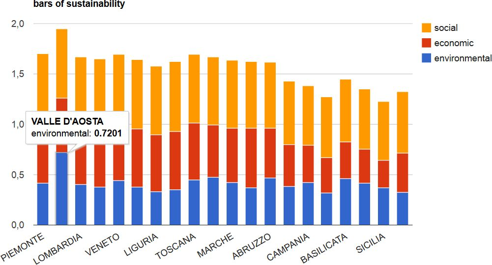

.. SSAM documentation master file, created by
   sphinx-quickstart on Sun Feb 02 22:41:59 2014.
   You can adapt this file completely to your liking, but it should at least
   contain the root `toctree` directive.

   
Spatial Sustainability Assessment Model - SSAM's **tutorial**
=========================================

Tutorial
--------

Step 0 - Load SSAM
+++++++++++++++++++++++++++

Load the file “regioni_test”, select it in QGIS  and run SSAM from the menu: **Plugin/SSAM/SSAM** (or pressing the icon on the toolbar).

.. figure:: ./_image/LoadPlugin.jpg
     :align: center
     :height: 300

	 
	 
Step 1 - Setting
++++++++++++++++

The page “Setting” shows the default setting parameters; if the values proposed are acceptable, we can press the “OK” button.

.. figure:: ./_image/setting.jpg
     :height: 500	
     :align: center
     

	 
Step 2 - Environmental criteria
+++++++++++++++++++++++++++++++

the page “Environmental criteria” shows the default values for the environmental assessment. For each criterion  (in the column header) the label, the weight, the preference (cost or gain), the ideal and worst point values are shown as default values. The user can change the values,  and with the button “Save”  he can register  the changes.  Pressing the “Apply” button the user runs the  calculation for the assessment  of the environmental index.

.. figure:: ./_image/env.jpg
     :height: 500
     :align: center
	 
Step 3 - Economic criteria
++++++++++++++++++++++++++

The page “Economic criteria” has the same structure than the environmental one, even the parameters have all the same meaning. With the button “Apply” we can run the model for the assessment of the economic index.

.. figure:: ./_image/eco.jpg
     :height: 500
     :align: center
	 
Step 4 - Social criteria
++++++++++++++++++++++++

The parameters in the “Social criteria” page have the same meaning than those for  Environmental and Economic assessment. The user can perform the calculation of the social index pressing the “Apply” button.

.. figure:: ./_image/analysis.jpg
     :height: 500
     :align: center
	 
Step 5 - Output maps
++++++++++++++++++++

All the indexes are calculated and now we can build the maps and the graph showing the outputs. The user has to press the “Load maps” button for loading four maps in QGIS: "EnvIdeal" (Environmental index), "EcoIdeal" (Economic index), "SocIdeal" (Social index) and the overall sustainability index map, named “SustIdeal”. 

.. figure:: ./_image/analysis.jpg
     :height: 500
     :align: center

     Analysis page

.. figure:: ./_image/sustMap.jpg
     :height: 500
     :align: center

     Output map example 

Step 6 - Output charts
++++++++++++++++++++++

From the combo box “Label field” the user has to choose the field of the attributes table that identifies the name of the “research unit” (eg. the name of the region). Pressing the “Graph” button, SSAM opens a html page in the browser with four graphs. The first shows a stack – histogram whose the overall height is proportional to the sustainability value as the sum (linear combination) of the three indexes (environmental, economic and social values).  The second graph is a “bubble-graph”: the position, dimension and color  of bubbles provide information about sustainability and its three dimensions. In particular, the x-axis is ordered with the environmental index, the y-axis is ordered with the economic index, the color (from red to green) is ordered with the social index, while the dimension of  the bubble is proportional to the sustainability value.  The third and the fourth graphs are quite similar to the the first two, but they are “static” and they do not require an internet active connection.

Step 7 - Extract rules
++++++++++++++++++++++

The last page, named **Rules**,  supplies a tool for data  discovery and back analysis of the assessment. Pressing the button “Extract rules”, the user gets the rules derived from the ranking performed by SSAM, based on five sustainability classes. Selecting a single rule, all the regions that support that rule will be selected in yellow on the maps in QGIS.

.. figure:: ./_image/rule_1.jpg
     :height: 500
     :align: center

     Rules extraction example (rule 12)

.. figure:: ./_image/rule_3.jpg
     :height: 500
     :align: center

     Rules extraction example (rule 2)

	

* :ref:`genindex`
* :ref:`modindex`
* :ref:`search`

. 